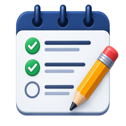
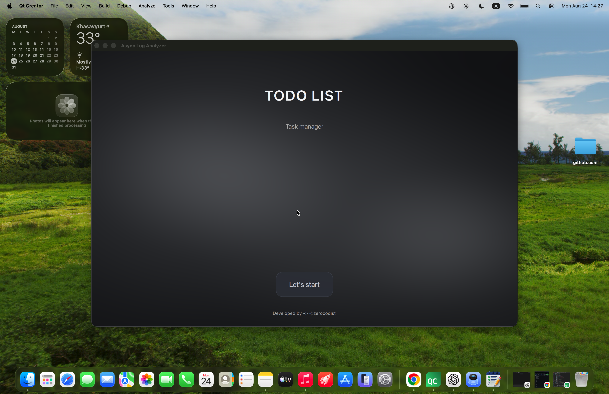

# Todo List
Todo List is a desktop application with **Qt6 / C++17**
for creating, managing your task.
---

<p align="center">

</p>


## Features
- Add Task
- SQLite database storage
- Pagination
- Search and filtering
- Change title
- Delete
- Multithreaded processing
- Modern QtQuick interface
- Animated shader background
---

## Technologies
- C++17
- Qt6
- QtQuick / QML
- SQLite
- CMake
- Qt test
---

## Screenshots
<p>
  
</p>

## Gif
<p>
  
</p>

## Build
```bash
git clone https://github.com/Zerocodist/TodoList.git
cd TodoList
mkdir build
cd build
cmake ..
cmake --build
```
---

## ProjectTest
This directory contains project rests.

Currently, testing functionality is under development and will be expanded in future updates.

Planned:
- Unit test for add task, and other fucntions
- Database tests
- Model and controller tests
- Integration testing

More tests will be added soon.
---

## Author
Zerocodist
Qt / C++ Developer
